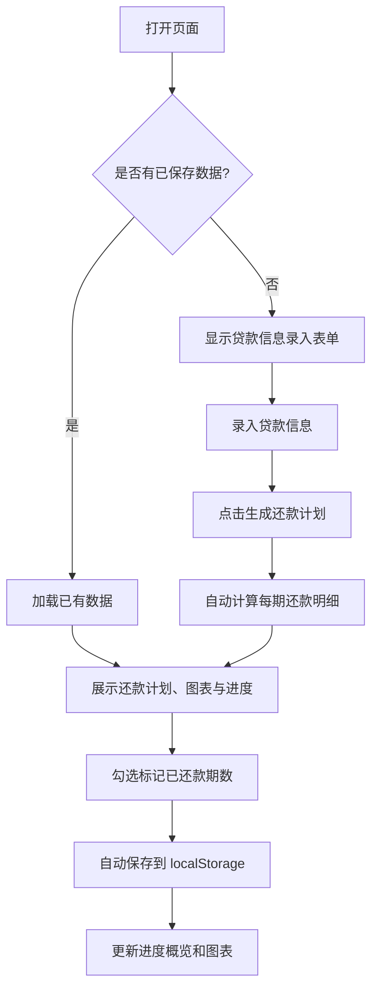
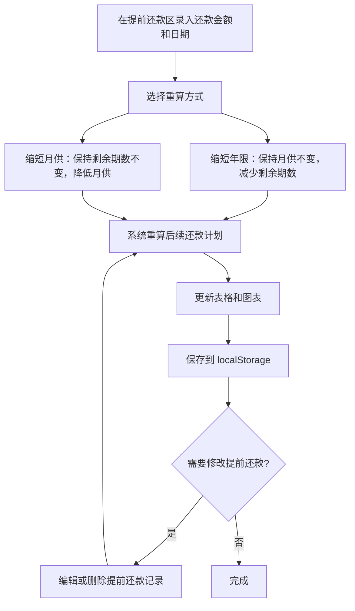

## 1. 产品概述

异地公积金贷款还款计划管理工具，帮助用户自定义录入贷款信息、自动生成还款计划、标记每月还款状态并自动跟进月度还款进度。解决异地公积金贷款用户无法在官方渠道便捷查看还款计划、追踪还款进度的痛点。

- 目标用户：持有异地公积金贷款、需要自行管理还款计划的个人用户
- 产品价值：提供清晰直观的还款计划视图，帮助用户掌握还款节奏、避免逾期

## 2. 核心功能

### 2.1 用户角色
无需登录注册，单用户本地使用，数据存储在浏览器 localStorage 中。

### 2.2 功能模块

1. **贷款信息录入**：自定义录入贷款金额、年利率、贷款期限、还款方式（等额本息/等额本金）、贷款开始日期
2. **还款计划生成**：基于录入信息自动计算每期还款额（本金+利息），生成完整还款计划表
3. **还款状态标记**：逐期勾选已还款/未还款状态，支持批量标记
4. **月度进度追踪**：展示已还期数/总期数、已还本金/总本金、已还利息、剩余本金等汇总数据
5. **图表报表**：饼图展示本金vs利息占比、柱状图展示月度还款趋势、面积图展示剩余本金递减曲线
6. **提前还款**：支持录入提前还款记录（还款日期、金额），选择缩短年限或缩短月供两种方式，自动重算后续还款计划，支持编辑和删除提前还款记录
7. **数据持久化**：所有数据自动保存到 localStorage，刷新不丢失

### 2.3 页面详情

| 页面名称 | 模块名称 | 功能描述 |
|---------|---------|---------|
| 主页面 | 贷款信息表单 | 录入贷款金额、年利率、期限、还款方式、开始日期，点击生成还款计划 |
| 主页面 | 还款进度概览 | 卡片式展示已还期数/总期数、剩余本金、已还利息、下期应还等关键指标 |
| 主页面 | 图表报表区 | 饼图（本金/利息占比）、柱状图（月度还款趋势）、面积图（剩余本金曲线） |
| 主页面 | 提前还款管理 | 录入提前还款金额和日期，选择缩短年限/缩短月供，重算计划，支持编辑/删除 |
| 主页面 | 还款计划表格 | 展示每期还款明细（期数、日期、月供、本金、利息、剩余本金、状态），支持勾选标记 |
| 主页面 | 数据管理 | 支持导出 JSON 备份、导入恢复、重置清空数据 |

## 3. 核心流程

### 3.1 主流程

### 3.2 提前还款流程

## 4. 用户界面设计

### 4.1 设计风格

- **主题**：温暖专业的金融工具风格，暖色调深色背景搭配金色点缀
- **主色调**：深色背景（#1a1a2e）+ 金色点缀（#e2b04a）+ 卡片色（#16213e）
- **辅助色**：绿色（#4ecca3）表示已还款、橙色（#f0a500）表示待还款、红色（#e74c3c）表示逾期
- **字体**：标题使用 Georgia 衬线字体，正文使用系统等宽字体确保数字对齐
- **布局**：顶部表单区 + 进度概览卡片 + 图表区 + 提前还款区 + 还款计划表格，单页纵向滚动
- **圆角与阴影**：卡片圆角 12px，柔和阴影增强层次感

### 4.2 页面设计概览

| 页面名称 | 模块名称 | UI 元素 |
|---------|---------|--------|
| 主页面 | 贷款信息表单 | 深色卡片容器，输入框带金色边框聚焦效果，等额本息/等额本金切换标签，生成按钮金色渐变 |
| 主页面 | 还款进度概览 | 四列卡片网格：已还期数、剩余本金、已还利息、下期应还，数字大号加粗 |
| 主页面 | 图表报表区 | 三列图表：饼图（本金/利息）、柱状图（月度还款）、面积图（剩余本金递减），使用 Canvas 绘制 |
| 主页面 | 提前还款管理 | 表单输入提前还款金额和日期，单选框切换缩短年限/缩短月供，记录列表可编辑删除 |
| 主页面 | 还款计划表格 | 深色背景表格，斑马纹行，已还款行绿色左边框，提前还款行特殊标记，复选框自定义样式 |
| 主页面 | 数据管理栏 | 底部小号文字按钮，导出/导入/重置 |

### 4.3 响应式设计

- 桌面端优先，最大宽度 1100px 居中
- 移动端表格横向滚动，卡片和图表网格改为单列堆叠
- 表单输入框在移动端占满宽度