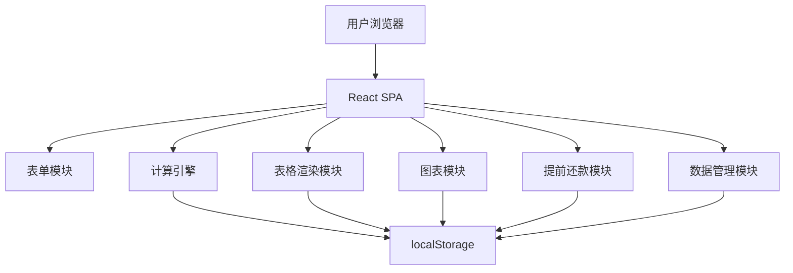

## 1. 架构设计

单页静态应用（SPA），React + TypeScript + Tailwind CSS + Vite 构建，数据存储在浏览器 localStorage。部署到 GitHub Pages。



## 2. 技术说明

- **前端**：React 18 + TypeScript + Tailwind CSS 3 + Vite
- **图表**：Canvas API 原生绘制（饼图、柱状图、面积图），无第三方图表库依赖
- **状态管理**：zustand
- **数据存储**：浏览器 localStorage（键名：`loan_repayment_data`）
- **部署**：GitHub Pages（静态托管）
- **初始化工具**：vite-init

## 3. 路由定义

单页应用，Tab 切换，无路由。

| 路由 | 用途 |
|------|------|
| / | 主页面，包含贷款信息录入、还款计划表格、图表报表、提前还款、进度概览、数据管理 |

## 4. 数据模型

### 4.1 数据结构

```typescript
interface LoanInfo {
  totalAmount: number;          // 贷款总额（元）
  annualRate: number;           // 年利率（%）
  totalMonths: number;          // 贷款期限（月）
  repaymentType: 'equalInstallment' | 'equalPrincipal';
  startDate: string;            // 贷款开始日期 YYYY-MM-DD
}

interface ScheduleItem {
  period: number;               // 期数
  date: string;                 // 还款日期 YYYY-MM-DD
  monthlyPayment: number;       // 月供
  principal: number;            // 本期本金
  interest: number;             // 本期利息
  remainingPrincipal: number;   // 剩余本金
  paid: boolean;                // 是否已还款
  isPrepaymentPoint: boolean;   // 是否为提前还款后重算的起始期
}

interface PrepaymentRecord {
  id: string;                   // 唯一标识
  date: string;                 // 提前还款日期
  amount: number;               // 提前还款金额
  mode: 'shortenTerm' | 'reduceMonthly'; // 缩短年限 | 缩短月供
  beforeRemainingPrincipal: number; // 提前还款前剩余本金
  afterRemainingPrincipal: number;  // 提前还款后剩余本金
  originalRemainingMonths: number;  // 原剩余期数
  newRemainingMonths: number;       // 新剩余期数（缩短年限时）
  originalMonthlyPayment: number;   // 原月供
  newMonthlyPayment: number;        // 新月供（缩短月供时）
}

interface LoanData {
  loanInfo: LoanInfo;
  schedule: ScheduleItem[];
  prepayments: PrepaymentRecord[];
  meta: {
    createdAt: string;
    updatedAt: string;
  };
}
```

### 4.2 计算逻辑

**等额本息**：
- 月利率 = 年利率 / 1200
- 月供 = 贷款总额 × 月利率 × (1 + 月利率)^总期数 / ((1 + 月利率)^总期数 - 1)
- 每期利息 = 剩余本金 × 月利率
- 每期本金 = 月供 - 每期利息

**等额本金**：
- 月利率 = 年利率 / 1200
- 每期本金 = 贷款总额 / 总期数
- 每期利息 = 剩余本金 × 月利率
- 每期还款额 = 每期本金 + 每期利息

**提前还款重算**：
- 缩短年限：用提前还款后的剩余本金、原月供、原利率，反算新剩余期数（保持月供不变）
- 缩短月供：用提前还款后的剩余本金、原剩余期数、原利率，重新计算新月供（保持期数不变）
- 提前还款记录可编辑/删除，删除后回退到该笔提前还款前的状态重新计算